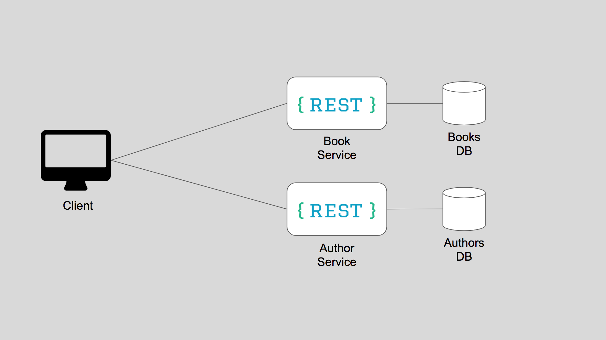
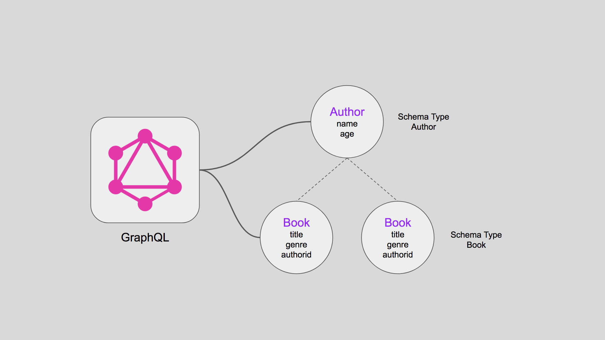

# GraphQL in a Micro Services Architecture

Today, it is becoming more and more common to break down a monolithic architecture into microservices, thereby creating many small APIs that work independently. In a microservices architecture, a bunch of services are broken down into independent smaller services which expose standard REST APIs to interact with.

They come with obvious advantages as these microservices are:

- Highly maintainable and testable
- Loosely coupled
- Independently deployable
- Organized around business capabilities
- Owned by a small team

## Problems in a Microservices Architecture

Although microservices make it easy for the services to be micromanaged by individual owners, it poses a challenge to the consumer of these APIs. For example, a front-end app that wants data which may be served at different microservices, the client has to make an API call to each microservice and combine the data to finally consume it in the UI elements. There is also the problem of overfetching and underfetching with these APIs. There could be certain fields in the data from one API, which the UI client may not even need, but still a bloated data is fetched.

Let's consider a simple example of a bookstore app with just two entities, a Book and an Author. Each entity is maintained by an individual microservice.



In order to display details of a book, minimum two API calls are required to be made, one to get Book info and one to get the respective Author info. Similarly, to display an Author details with all the Books written by them, two API calls are required to be made, one to get Author info and one to get the list of books for that author.

This approach has visible issues such as:

- Multiple API calls required to be made to get relevant data, resulting in chattiness between client and server.
- This makes the app brittle and multiple calls slow down the app.
- Since each microservice is now exposed to the client, all of them have to be made secure.

## GraphQL in a Microservices Architecture

In order to solve this problem, the framework that is being widely used these days is GraphQL. One way to look at it is that GraphQL can be leveraged as an API gateway for interacting with multiple microservices, each dedicated to a single resource type while living alongside standard REST routes.

GraphQL and microservices are a perfect fit because GraphQL hides the fact that you have a microservice architecture from the clients. From a backend perspective, you want to split everything into microservices, but from a frontend perspective, you would like all your data to come from a single API. GraphQL lets you split up your backend into microservices while still providing a single API to all your applications, and allowing joins across data from different services.

If the bookstore scenario discussed above is implemented with a GraphQL middleware, the architecture would look something like below:


## What is GraphQL

GraphQL is an API that was invented and open-sourced by Facebook as a better replacement for REST. It can be understood as a query language for APIs, which enables declarative data fetching by exposing a single endpoint and responds to queries. In REST, there is always a dedicated endpoint for each type of request and can't be customized. In GraphQL, the client decides what data they need and that's the reason the client sends a query (payload) to the server and the server sends the data back as per the query request. There is where they get the name GraphQL. GraphQL is, in many ways, one of the more powerful tools an API provider has in terms of providing singular endpoints to the consumer and controlling data flow.

## Type System in GraphQL

GraphQL’s powerful expressive ability mainly comes from its complete type system. Unlike REST, it regards all resources in the entire Web service as a connected graph, rather than a resource island, which can be accessed when accessing any resource. Access other resources through connections between resources.

The bookstore schema graph would look something like below:



## Wiring data with a GraphQL query

GraphQL can simply be treated as the middleware of a backend system. Hence, it is very easy to plug it in with existing systems. For example, in NodeJS implementation of GraphQL, data against a query can be fetched via a resolve function, that simply returns a promise. The logic to query the data (e.g. calling an existing REST API) can be written in this resolve function.

For our bookstore app, the NodeJS implementation to fetch Author details by id would look something like below. Note the resolve function. Data here is fetched from a MongoDB model.

```javascript
author: {
    type: AuthorType,
    args: {id: {type: GraphQLID}},
    resolve(parent, args) {
        // fetch author by id from MongoDB
        return AuthorModel.findById(args.id);
    }
}
```

## Wiring data with a GraphQL query

GraphQL can simply be treated as the middleware of a backend system. Hence, it is very easy to plug it in with existing systems. For example, in NodeJS implementation of GraphQL, data against a query can be fetched via a resolve function, that simply returns a promise. The logic to query the data (e.g. calling an existing REST API) can be written in this resolve function.

For our bookstore app, the NodeJS implementation to fetch Author details by id would look something like below. Note the resolve function. Data here is fetched from a MongoDB model.

```javascript
const AuthorType = new GraphQLObjectType({ 
    name: 'Author', 
    fields: () => ({ 
        id      : {type: GraphQLID},  
        name    : {type: GraphQLString}, 
        age     : {type: GraphQLInt}, 
        books   : { 
            type: new GraphQLList(BookType), 
            resolve(parent, args){ 
                return BookModel.find({authorid: parent.id}) 
            } 
        } 
    }) 
}) 
```

## Authentication and Authorization with GraphQL

Authentication and authorization are other issues that need to be considered when using GraphQL. Do we process them before or after the GraphQL parsing process? To answer this question, you can think of GraphQL as a DSL (Domain Specific Language) on top of your own backend data acquisition logic. We just need to think of it as an intermediate layer that can be placed between the client and our actual data service (or multiple services). Then consider authentication and authorization as another layer. GraphQL is not useful in the actual implementation of authentication or authorization logic because it does not mean it. However, if we want to place these layers behind GraphQL, we can use GraphQL to pass the access token between the client and Auth API. This is very similar to the way we authenticate and authorize via the RESTful API.

## Integrating with a Ecommerce App

The GraphQL implementation (irrespective of the language implemented in) exposes a REST endpoint which is always a POST call with the query as request body. Now, this GraphQL endpoint can be imported into a Ecommerce app like any other REST API through the REST API import interface in Ecommerce studio. Once imported, UI can be built while binding to the GraphQL data in the form of a service variable without writing any code on the UI.

# GraphQL Microservice Architecture with Redis Cache

## Overview

This repository demonstrates the advantages of using GraphQL with a microservice architecture and Redis cache. By combining these technologies, developers can build flexible, performant, and scalable systems capable of meeting the evolving needs of modern applications.

## Advantages

1. **Flexibility**: GraphQL allows clients to request only the data they need, reducing over-fetching and under-fetching issues commonly found in traditional RESTful APIs. In a microservices setup, each service can implement its own GraphQL schema tailored to its domain, enabling teams to work independently and evolve their APIs without affecting other services.

2. **Performance**: Redis cache can significantly improve the performance of GraphQL queries by caching frequently accessed data. By storing the results of expensive or repetitive queries in Redis, subsequent requests for the same data can be served much faster, reducing the load on downstream services and databases.

3. **Scalability**: Microservices and Redis cache can both be horizontally scaled to handle increased traffic and workload. With microservices, individual services can be scaled independently based on their specific requirements, while Redis provides high-performance caching that can be distributed across multiple nodes to handle growing data volumes.

4. **Resilience**: Decoupling services in a microservices architecture reduces the blast radius of failures, as issues in one service are less likely to impact others. Additionally, Redis supports features like replication and clustering, which enhance data resilience and fault tolerance, ensuring high availability even in the event of node failures.

5. **Real-time Updates**: Redis can be used to implement pub/sub messaging patterns, enabling real-time updates to subscribed clients. This is particularly useful in scenarios where clients need to receive instant notifications or updates based on changes in the underlying data, such as live chat applications or real-time analytics dashboards.

6. **Reduced Database Load**: By caching frequently accessed data in Redis, the load on backend databases can be reduced, leading to improved database performance and scalability. This is especially beneficial in scenarios with high read-to-write ratios, where caching read-heavy queries can offload the database and improve overall system responsiveness.

7. **Cost Optimization**: By leveraging Redis cache to reduce the number of database queries and scaling microservices based on demand, organizations can optimize infrastructure costs by efficiently utilizing resources and minimizing over-provisioning.

